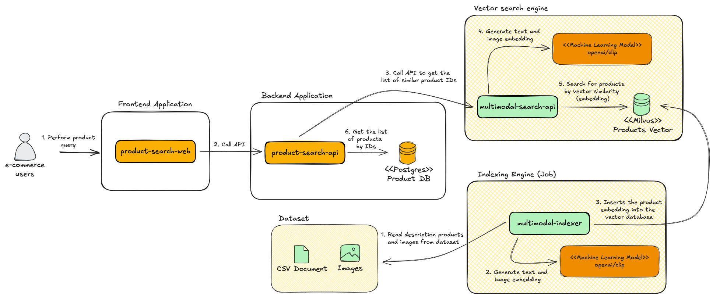
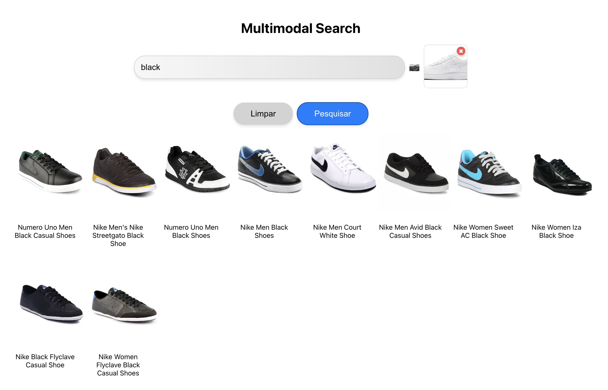
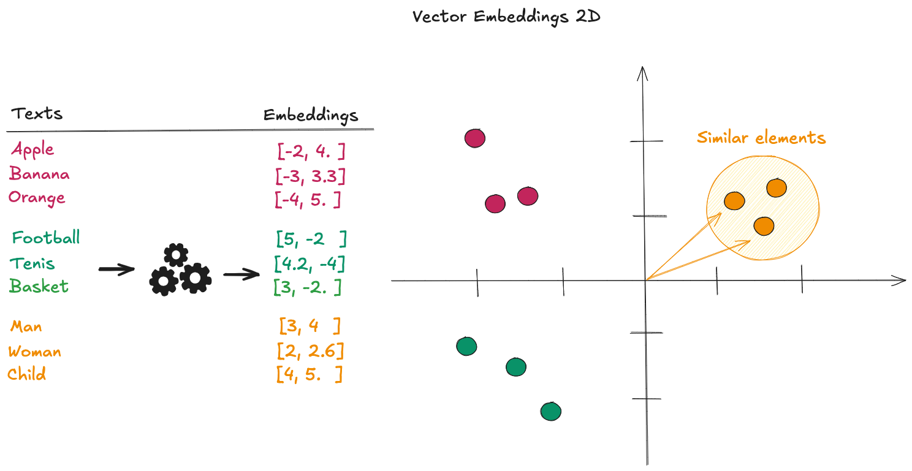

# Sistema de Busca Multimodal

    

Este repositório contem a implementação de um **sistema de busca multimodal**, projetado para simular um mecanismo avançado de busca de produtos em um e-commerce fictício utilizando texto, imagens, ou a combinação de ambos. O sistema permite realizar consultas eficientes, proporcionando uma experiência mais flexível.  

## Arquitetura


### Componentes
| **Componente**            | **Descrição**                                                                                          |
|---------------------------|------------------------------------------------------------------------------------------------------|
| **product-search-web**    | Interface web voltada para os usuários do e-commerce, permitindo a consulta de produtos disponíveis. |
| **product-search-api**    | Backend responsável por realizar as buscas de produtos, integrando-se às bases de dados necessárias. |
| **multimodal-search-api** | Serviço que permite buscar itens similares na base de dados vetorial a partir de texto, imagem ou ambos. |
| **multimodal-indexer**    | Job responsável por processar o dataset (CSV e imagens), gerar embeddings para os produtos e armazená-los no banco vetorial. |
| **Postgres**              | Banco de dados relacional que armazena informações detalhadas sobre os produtos, como nome, URL da imagem, categoria e atributos adicionais. |
| **[Milvus (Vector Database)](https://milvus.io/)**                | Banco de dados vetorial utilizado para armazenar os embeddings (vetores) dos produtos e seus respectivos IDs, otimizando buscas por similaridade. |
| **[Transformer](https://pypi.org/project/transformers/)**       | Biblioteca Python que oferece uma ampla gama de modelos de Machine Learning pré-treinados baseados em Transformers, utilizada para gerar embeddings a partir do dataset de texto ou imagens, permitindo a representação semântica dos dados para buscas eficientes. |

### Tecnologias
| **Categoria**         | **Ferramenta/Descrição**                                                                                              |
|------------------------|-----------------------------------------------------------------------------------------------------------------------|
| **Linguagem**          | Python, JavaScript (Node)                                                                                             |
| **Bibliotecas**        | Flask, Torch, Transformers, Pillow, Pymilvus, React                                                                   |
| **Banco de Dados**     | Milvus, Postgres                                                                                                      |
| **Dataset**            | [E-commerce Product Images](https://www.kaggle.com/datasets/vikashrajluhaniwal/fashion-images) (disponível no Kaggle) |


## Instalação

A aplicação está configurada para ser executada com Docker Compose. Siga os passos logo abaixo, mas assegure-se de ter os pré-requisitos instalados:

**Pré-requisitos:**
- Python 3.11 ou superior
- Node 20.12 ou superior (para executar projeto localmente)

1. **Clona o repositório**

```bash
git clone https://github.com/Waelson/multimodal-search.git
cd multimodal-search
```

2. **Inicializa a stack**

```bash
docker-compose up --build
```

3. **Prepara a indexação do dataset**
- Cria um Virtual Environment do Python

```bash
python -m venv my-venv
```

- Ativa o Virtual Environment

```bash
source my-venv/bin/activate
```
- Instala as dependências

```bash
pip install -r _requirements.txt
```

- Executa o processo de indexação do dataset

```bash
cd projects/multimodal-indexer
python app.py
```

4. **Acessa a aplicação**
- Digite a URL http://localhost:3001/ no browser
- Clique no ícone da `câmera` para selecionar uma imagem. Lembre-se: a base de dados contém imagens de tênis e calçados masculino e feminino, além de roupas infantis masculinas e femininas. Portanto, ao realizar a consulta selecione imagens nessas categorias. 

## Interface de Consulta de Produtos


   
## 🧠 Teoria

### 💡Busca multimodal

___

#### O que é?
São buscas que combinam diferentes tipos de dados (ou "modalidades") para encontrar resultados. Por exemplo, você pode buscar com uma imagem e um texto ao mesmo tempo, ou usar áudio e vídeo como entrada para encontrar conteúdos relacionados.

#### Quais problemas ela ajuda a resolver?

1. **E-Commerce**
   - **Busca de produtos por imagem e texto:**
      - O cliente pode carregar a foto de um produto e adicionar um texto como "sapato vermelho tamanho 40", e o sistema encontrará itens que correspondem à imagem e à descrição.
   - **Recomendações personalizadas:**
      - Sugerir produtos relacionados a uma combinação de fotos enviadas e histórico de pesquisa textual.
2. **Saúde**
   - **Busca por diagnósticos médicos:**
      - Médicos podem combinar imagens de exames (como raios-X ou ressonâncias) com descrições textuais de sintomas para encontrar diagnósticos ou casos similares.
3. **Educacional**
   - **Busca em conteúdos educacionais:**
      - Estudantes podem combinar texto (ex.: "Teoria da Relatividade") com gráficos ou diagramas, encontrando explicações que relacionam ambas as modalidades.


### 💡Vector Database

___

#### O que são e para que servem?

É um tipo de banco de dados projetado para armazenar e buscar vetores de alta dimensão, que são representações numéricas geradas por algoritmos de aprendizado de máquina. Esses vetores capturam características semânticas de dados complexos, como textos, imagens, áudios ou vídeos.

Os vetores são armazenados no banco e podem ser consultados com base em similaridade (em vez de buscas exatas), usando métricas como:
- Similaridade de cosseno
- Distância Euclidiana
- Distância de Manhattan

### 💡Embeddings 

___

#### O que são?

Imagine que você quer comparar diferentes frutas. Cada fruta tem características como "doçura", "acidez" e "tamanho". Se quisermos representar essas características com números, podemos fazer algo assim:

- Maçã: `[7, 3, 5]` (doçura: 7, acidez: 3, tamanho: 5)
- Laranja: `[5, 8, 4]` (doçura: 5, acidez: 8, tamanho: 4)
- Banana: `[9, 2, 6]` (doçura: 9, acidez: 2, tamanho: 6)

Agora, temos uma representação numérica (um vetor) que descreve cada fruta. Isso é parecido com o que embeddings fazem: transformam algo complicado em uma lista de números que o computador entende.

#### Para que servem?

Eles ajudam a comparar e encontrar semelhanças entre coisas. Por exemplo:

- Mesmo que você descreva uma maçã em palavras diferentes ("uma fruta doce e crocante"), o computador pode entender que você está falando da mesma coisa.
- No caso de imagens, um embedding pode ajudar a identificar que duas fotos diferentes mostram o mesmo cachorro.

#### Como funciona a busca por similaridade?

A imagem abaixo mostra uma representação matemática de como alguns textos são transformados em `embeddings` (vetor) e sua representação em um gráfico 2D.




**O que acontece quando você busca o termo "person"?**

- Primeiro, o termo "person" é transformado em um vetor de números, chamado de embedding. Por exemplo, o vetor pode ser algo como [3, 4], que representa as características semânticas do termo "person".
- Esse vetor será comparado com os embeddings já existentes no banco de dados (no caso, os vetores de "man", "child" e "woman").

**Como medir similaridade?**

A similaridade entre os vetores é calculada medindo a "distância" entre eles. As duas maneiras mais comuns são:
- **Distância Euclidiana**: Imagine os pontos desenhados em um gráfico (como no lado direito da imagem). A distância é medida como se usássemos uma régua entre os pontos.
- **Produto interno ou cosseno**: Mede o ângulo entre os vetores, indicando o quão próximos estão em "direção" e não apenas em posição.

Quanto menor a distância ou maior a proximidade, mais semelhantes os itens são.